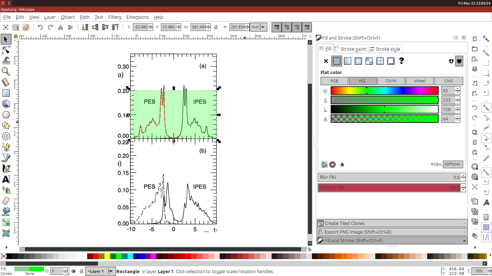
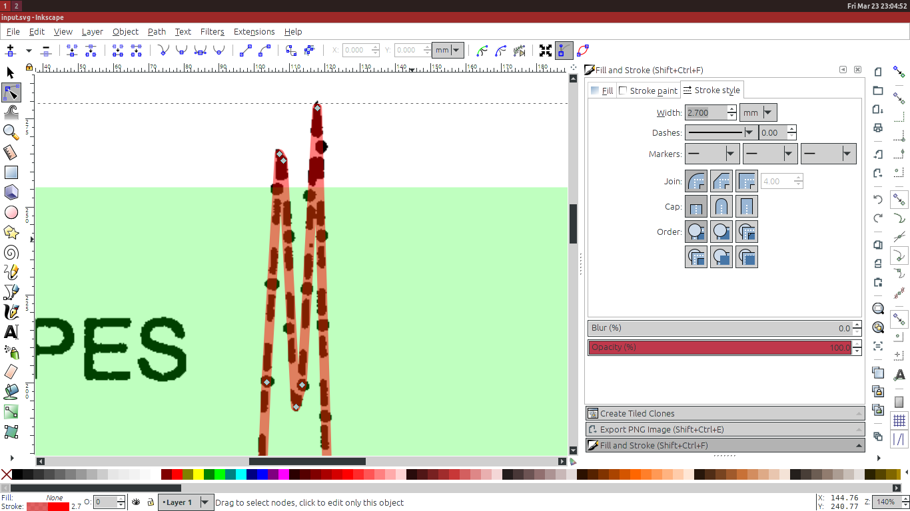
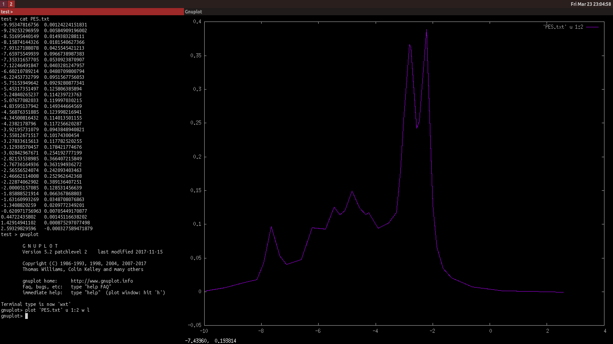

# Plot-Digitizer
Trace data plots with SVG editor.

Plot-Digitizer is a basic tool for converting a raster plot into
plain text data points.

## Usage

In this example I will trace the density of states of a 16-site
Hubbard model from Elbio Dagotto, 1994.

1. Import the plot you would like to trace into your SVG editor (for
example, Inkscape). Set the reference points by drawing a rectangle
(see photo, green). Draw a line following the plot using the Bezier
tool (see photo, red).

REMARKS:
* When importing the raster, it is enough to only rotate and deskew.
  There is no need to stretch, adjust image boundaries etc.
* The rectangle does not have to cover the whole plot. Put its
  corners in the points for which you know the exact values.
* To improve precision it is recommended to:
  make the line half-transparent and with width and joint style
  matching those of the plot;
  avoid using Bezier curves and instead trace by hand, because this
  yields the best detail per number of points.
* An external tool must be used to convert the output to polar
  coordinates, nonlinear or logarithmic scale.

2. Save the SVG file and run the tool. I have saved it as `input.svg`
   and want the output in `PES.txt`.

    $ svg_converter.py input.svg -5.0 5.0 0.0 0.2 > PES.txt

The 7 arguments are the following.
1. Name of the SVG file.
2. Minimum X coordinate of the reference rectangle.
3. Maximum X coordinate of the reference rectangle.
4. Minimum Y coordinate of the reference rectangle.
5. Maximum Y coordinate of the reference rectangle.
6. Delimiter (default tab-separated)
7. Name of output file (if given)

Extracted data points are printed to a variety of ways. It can output to file or stdout, as csv or separated by any given delimiter.

## Legal

Distributed under the terms of GNU GPLv3.

Copyright (c) [OldOxygen](https://github.com/OldOxygen), [Michael Danilov](https://github.com/mike402), 2018
