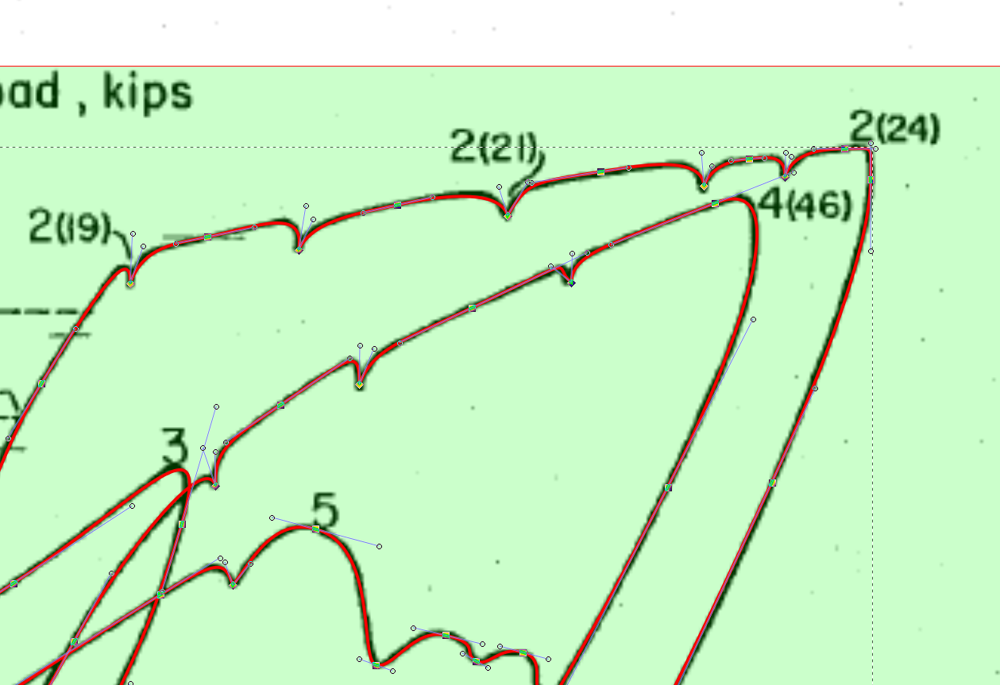
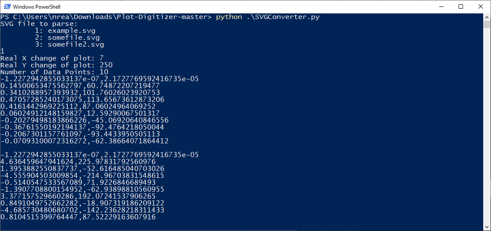

# Plot-Digitizer

Plot-Digitizer is a basic tool for converting a raster plot into
plain text data points.

It is necessary to trace the plot with a vector program. This tool will calculate points along the Bezier curve, and use the scales provided to output the points as (x,y) coordinates in csv format.

## Usageasdfasdfasdf

In this example I will trace the experimental test data from Oesterle et al (1979) B9 wall sample.

1. Import the plot you would like to trace into your SVG editor (for
example, Inkscape). Set the reference points by drawing a rectangle
(see photo, green). Draw a line following the plot using the Bezier
tool (see photo, red).

2. Save the SVG file and run the tool. I have saved it as `input.svg`
   and want the output to go to `out.csv` with 1000 points along the path.

    `$ SVGConverter.py -f input.svg -o out.csv -dx 7 -dy 250 -n 1000`

There are a total of 8 arguments, 4 essential and 4 optional
1. Name of the SVG file [-f]
2. Change of X in the reference rectangle [-dx]
3. Change of Y in the reference rectangle [-dy]
4. Number of divisions (output points) [-n]
5. Name of the output file [-o] (optional, default = stdout)
6. X origin of reference rectangle [-xo] (optional, default = 0)
7. Y origin of reference rectangle [-yo] (optional, default = 0)
8. Delimiter of output [-d] (optional, default = ',')

If the needed arguments are not given when run, it will prompt the user for those inputs as seen in the examples below.

And finally, an example of the 1000 points plotted.

**REMARKS:**
* Multiple paths can be used in the same file, the output will separated by newline.
* When importing the raster, it is enough to only rotate and align the image. There should be no need to stretch or adjust image boundaries, since the reference rectangle's dimensions can be set to different values.
* The rectangle does not have to cover the whole plot. Put its corners on the points where the exact values are known.
* An external tool must be used to convert the output to polar coordinates, nonlinear or logarithmic scale.
* Due to the nature of Bezier curves, if there is asymmetic handle length the points will also be asymmetrically placed along the curve. This should not be a problem unless exactly equal distances between points is required. The figure below shows an extreme example. 

## Legal

Distributed under the terms of GNU GPLv3.

Copyright (c) [OldOxygen](https://github.com/OldOxygen), [Michael Danilov](https://github.com/mike402), 2018
