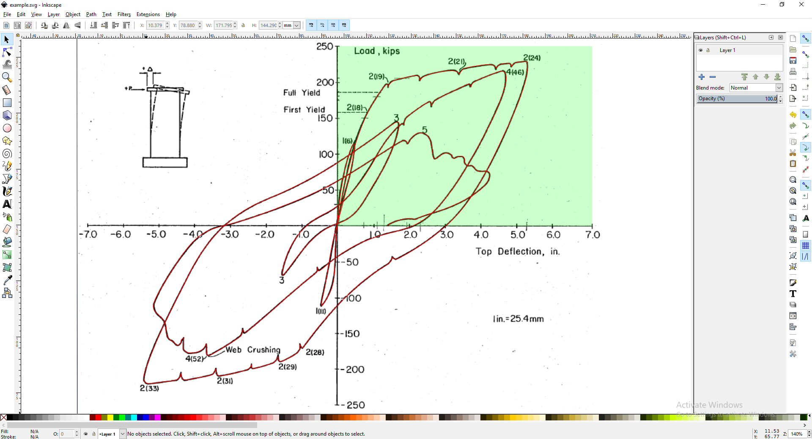

# Plot-Digitizer

Plot-Digitizer is a basic tool for converting a raster plot into
plain text data points.

It is necessary to trace the plot with a vector program. This tool will calculate points along the bezier curve, and use the scales provided to output the points as (x,y) coordinates in any form.

## Usage

In this example I will trace the experimental test data from Oesterle et al (1979) B9 wall sample.

1. Import the plot you would like to trace into your SVG editor (for
example, Inkscape). Set the reference points by drawing a rectangle
(see photo, green). Draw a line following the plot using the Bezier
tool (see photo, red).

2. Save the SVG file and run the tool. I have saved it as `input.svg`
   and want the output in `out.csv` with 1000 data points along the path.

    `$ SVGConverter.py -f input.svg -o out.csv -dx 6 -dy 250 -div 1000`

There are a total of 8 arguments, 4 essential and 4 optional
1. Name of the SVG file [-f]
2. Change of X in the reference rectangle [-dx]
3. Change of Y in the reference rectangle [-dy]
4. Number of divisons (output points) [-div]
5. Name of the output file [-o] (optional, default = stdout)
6. X origin of reference rectangle [-xo] (optional, default = 0)
7. Y origin of reference rectangle [-yo] (optional, default = 0)
8. Delimiter of output [-div] (optional, default = ',')

If the needed arguments are not given when run, it will prompt the user for those inputs as seen in the examples below.

And finally, an example of the -div 1000 output plotted.

**REMARKS:**
* Multiple paths can be used in the same file, the export will separate them by newline.
* When importing the raster, it is enough to only rotate and deskew. There is no need to stretch, adjust image boundaries etc.
* The rectangle does not have to cover the whole plot. Put its corners in the points for which you know the exact values.
* To improve precision it is recommended to make the line half-transparent and with width and joint style matching those of the plot
* An external tool must be used to convert the output to polar coordinates, nonlinear or logarithmic scale.

## Legal

Distributed under the terms of GNU GPLv3.

Copyright (c) [OldOxygen](https://github.com/OldOxygen), [Michael Danilov](https://github.com/mike402), 2018
